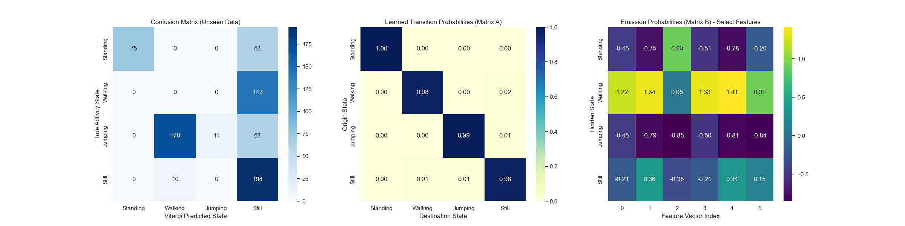

# Human Activity Recognition using Hidden Markov Models

> Formative Assessment 2 — Machine Learning Techniques II

This project implements a **Gaussian Hidden Markov Model (HMM)** to classify human physical activities from smartphone accelerometer and gyroscope sensor data.

## Project Overview

The system processes raw 6-axis sensor data (3-axis accelerometer + 3-axis gyroscope) sampled at **50 Hz**, extracts time and frequency domain features, and uses a trained HMM to decode activity sequences via the **Viterbi algorithm**.

## Activities Recognized

| Activity | Description |
|----------|-------------|
| Standing | Stationary upright position |
| Walking  | Normal walking pace |
| Jumping  | Vertical jumping motion |
| Still    | Device at rest (no movement) |

## Project Structure

```
├── data/
│   ├── raw/                    # Training data (50 CSV files)
│   └── unseen_test_data/       # Held-out test data (52 CSV files)
├── figures/
│   └── matrix.png              # Confusion matrix & transition heatmaps
├── models/
│   ├── activity_hmm_model.pkl  # Trained HMM model
│   └── feature_scaler.pkl      # Fitted StandardScaler
├── notebooks/
│   └── hmm_model.ipynb         # Complete training & evaluation pipeline
├── scripts/
│   └── unzip.py                # Data extraction utility
└── raw_zips_inbox/             # Inbox for raw sensor zip files
```

## Feature Engineering

Features are extracted from sliding windows of **50 samples (1 second)** to capture complete movement cycles.

### Time-Domain Features
- **Variance**: Quantifies signal spread — distinguishes dynamic activities (jumping) from static ones (standing)
  
  $$\sigma^2 = \frac{1}{N} \sum_{i=1}^{N} (x_i - \mu)^2$$

- **Root Mean Square (RMS)**: Measures average signal magnitude indicating overall movement intensity
  
  $$RMS = \sqrt{\frac{1}{N} \sum_{i=1}^{N} x_i^2}$$

### Frequency-Domain Features
- **Dominant Frequency**: Extracted via FFT to identify rhythmic movement patterns (e.g., walking cadence)

### Noise Gate
A variance threshold (`< 0.001`) forces dominant frequency to `0.0` for stationary signals, preventing FFT from amplifying sensor noise.

### Normalization
All features are Z-score standardized to prevent magnitude bias:

$$z = \frac{x - \mu}{\sigma}$$

## Model Architecture

| Component | Description |
|-----------|-------------|
| **Model Type** | Gaussian HMM with diagonal covariance |
| **Hidden States** | 4 (one per activity class) |
| **Observations** | 18-dimensional feature vectors (3 features × 6 sensor axes) |
| **Training Algorithm** | Baum-Welch (Expectation-Maximization) |
| **Decoding Algorithm** | Viterbi (dynamic programming) |
| **Convergence Threshold** | ε < 10⁻⁴ |
| **Max Iterations** | 1000 |

## Evaluation Metrics

The model is evaluated on unseen test data using:

$$Accuracy = \frac{TP + TN}{TP + TN + FP + FN}$$

$$Sensitivity \ (Recall) = \frac{TP}{TP + FN}$$

$$Specificity = \frac{TN}{TN + FP}$$

$$F1 \ Score = 2 \times \frac{Precision \times Sensitivity}{Precision + Sensitivity}$$

## Dependencies

```
numpy
pandas
scipy
scikit-learn
hmmlearn
matplotlib
seaborn
joblib
```

## Usage

### Training & Evaluation

Run the complete pipeline in the Jupyter notebook:

```bash
jupyter notebook notebooks/hmm_model.ipynb
```

### Loading the Trained Model

```python
import joblib

# Load model and scaler
model = joblib.load('models/activity_hmm_model.pkl')
scaler = joblib.load('models/feature_scaler.pkl')

# Normalize new features and predict
X_scaled = scaler.transform(new_features)
predicted_states = model.predict(X_scaled, lengths)
```

## Diagnostic Visualizations

The notebook generates:
1. **Confusion Matrix** — True vs predicted activity states
2. **Transition Matrix Heatmap** — Learned state transition probabilities (Matrix A)
3. **Emission Probabilities Heatmap** — Gaussian means per hidden state (Matrix B)



## Data Format

Each CSV contains time-indexed sensor readings:

| Column | Description |
|--------|-------------|
| `time` | Timestamp (nanoseconds, normalized to seconds) |
| `x_acc`, `y_acc`, `z_acc` | 3-axis accelerometer (m/s²) |
| `x_gyro`, `y_gyro`, `z_gyro` | 3-axis gyroscope (rad/s) |

## Key Implementation Details

- **Sequence Boundaries**: Training preserves individual file boundaries via `lengths` parameter to prevent cross-file transition learning
- **Reproducibility**: Model uses `random_state=42` and `init_params="kmeans"` for deterministic initialization
- **Model Persistence**: Trained model and scaler are serialized with `joblib` for deployment